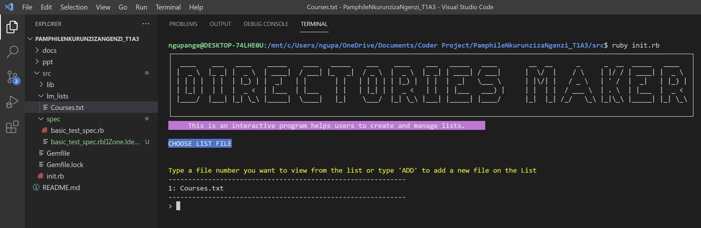

# PamphileNkurunzizaNgenzi_T1A3

# School Directories Terminal App

## Statement of Purpose

After the portfolio assignment I decided to start a project from scratch and apply on that project all skills I learn from this course . I chose a project that I will design a system to manage a school, my aim is to finish this bootcamp with a working school management system.

This terminal Ruby application is like a prototype or a blueprint that will help a system user with a right privilege to:

- See list of directories or files,
- Create a new directory or a file,
- Interact with the current directory (Add, view, delete or edit an item on list).

## Purposes and solutions

In this project a user with admin privillege will have options to create lists or directories of anything and save it into a file then user using terminal can view that list create new list visualise these lists, add new record and delete a record or edit it. Access issue is out of scope for this project.

## Target audience

On this project it's a just a prototype which will help any user with right privillege to create some lists. Example :
Teacher’s list
Student’s list
Subjects list
Courses / Subjects list
Books
etc

## User interection and experience

### Add a file / directory

This feature user need to type "add" command and will be asked to give a name for new file / directory then the app will handle the rest.

### View a file

This feature user need to type "add" command and will be asked to give a name for new file / directory then the app will handle the rest
